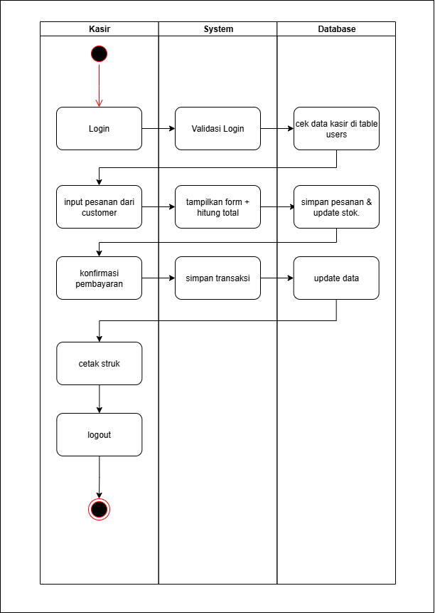
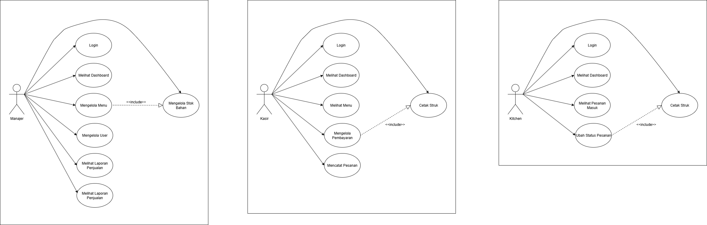
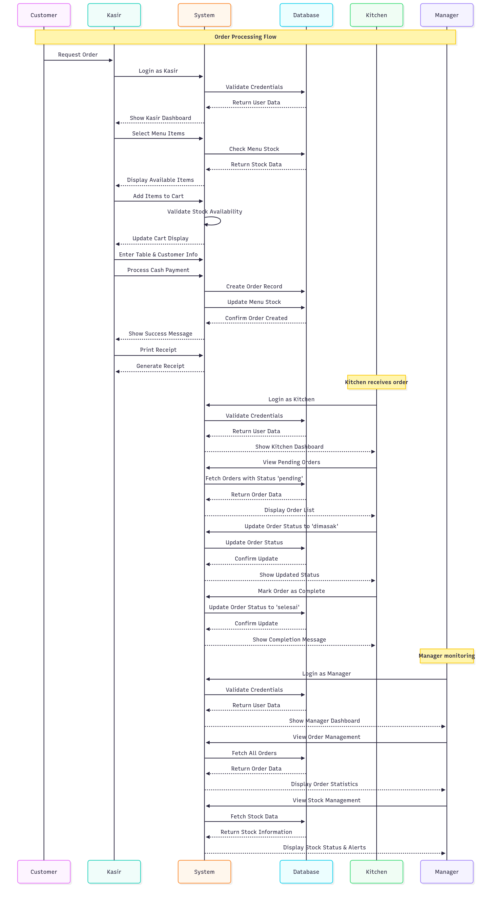
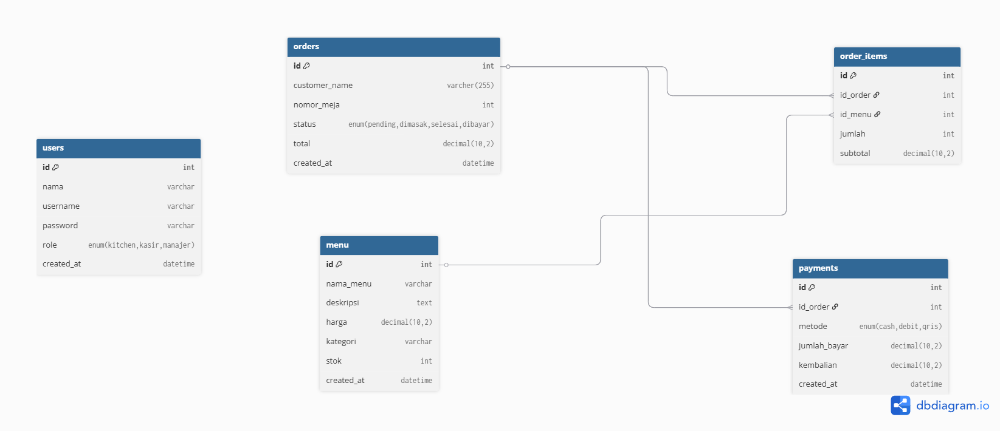
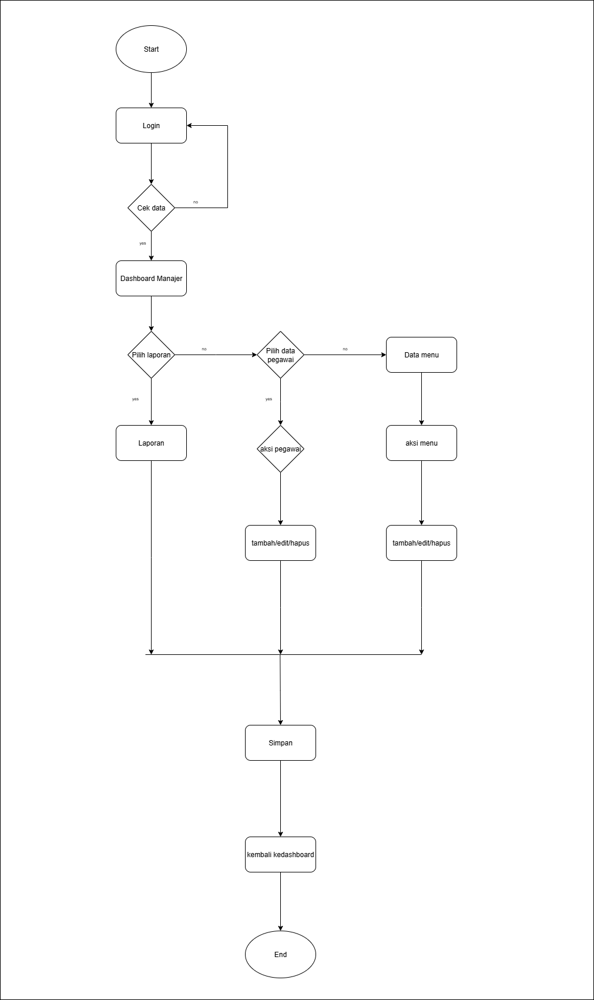
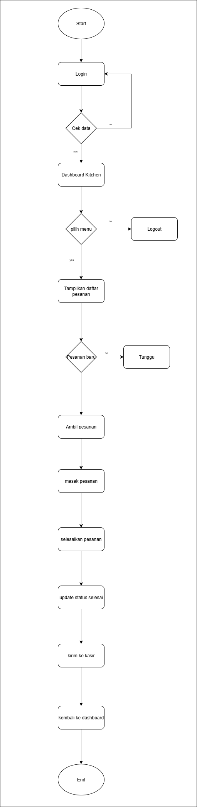

<h1>🍽️ Aplikasi Kasir Restoran - Proyek RPL Semester Ganjil</h1>

Aplikasi ini dikembangkan sebagai bagian dari proyek semester ganjil pada mata pelajaran **Rekayasa Perangkat Lunak (RPL)**.  
🎯 Tujuan dari aplikasi ini adalah untuk mempermudah proses transaksi di sebuah restoran melalui sistem kasir berbasis web.  

🛠️ Aplikasi ini dibangun menggunakan **PHP Native** dan **MySQL** sebagai penyimpanan data.  

---

## ✨ Fitur Utama Aplikasi

### 👨‍💼 Untuk Admin / Manajer
- 👤 Pengelolaan data pengguna (menambahkan & mengelola akun kasir serta kitchen)  
- 📋 Pengelolaan menu restoran (tambah/ubah/hapus makanan & minuman)  
- 📊 Melihat laporan penjualan  

### 💰 Untuk Kasir
- 📝 Mencatat pesanan pelanggan  
- 💵 Menghitung total pembelian  
- 🖨️ Mencetak struk pembayaran  
- 📂 Melihat riwayat transaksi  

### 👨‍🍳 Untuk Dapur (Kitchen)
- 🍲 Melihat daftar pesanan yang masuk  
- ✅ Mengupdate status pesanan (diproses / selesai)  

---

## 🎯 Kesimpulan
Aplikasi ini diharapkan dapat menjadi solusi sederhana namun efektif dalam **digitalisasi proses kasir di restoran kecil hingga menengah**, sekaligus menjadi sarana pembelajaran dalam pengembangan aplikasi web berbasis framework.

## 🖼️ Desain Antarmuka (UI)

Berikut adalah tampilan antarmuka aplikasi kasir restoran yang telah dikembangkan:

## 🖼️ Desain UI

| Halaman Index Utama | Halaman Login |
|---------------------|---------------|
|  |  |

| Halaman Home | Halaman Home Pembayaran |
|--------------|-------------------------|
|  |  |

---

## 🔄 Diagram

Untuk memperjelas alur kerja aplikasi, berikut adalah diagram kasir restoran:

### 📌 Activity Diagram 

### 📌 Use Case Diagram

### 📌 Sequence Diagram

### 📌 ERD/Database Diagram

## 🔄 Flowchart Sistem

Berikut adalah flowchart sistem aplikasi **KasirKita** untuk masing-masing peran pengguna:

| Flowchart Kasir | Flowchart Manajer |
|-----------------|-------------------|
|  |  |

| Flowchart Kitchen |
|-------------------|
|  |
